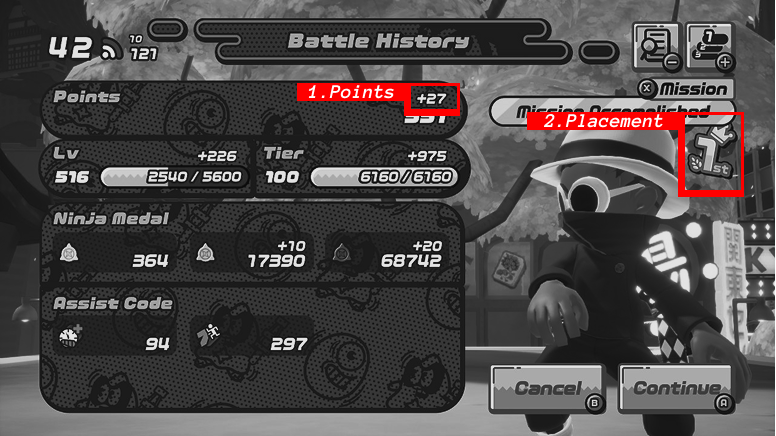
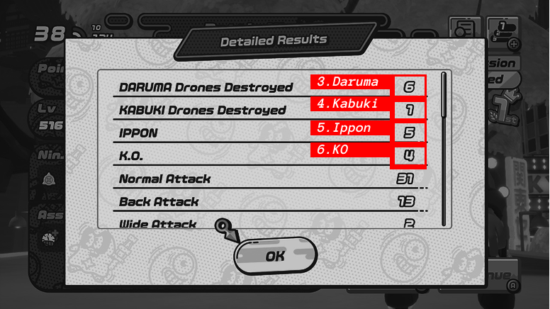
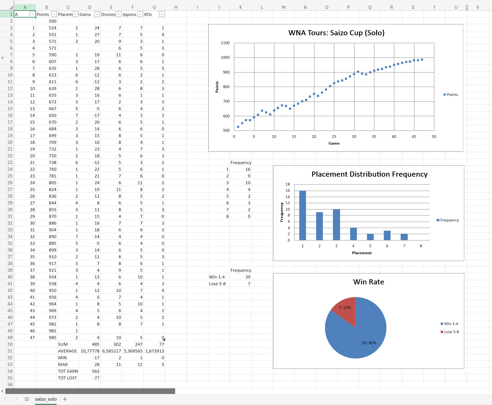

# About
This is an unofficial fan project related to the *Nintendo Switch* game **Ninjala™**.

The Ninjala™ Tournament Statistics Creator extracts statistical values from provided screenshots and exports them as an Excel file. The goal is to evaluate and visualize the results of in-game tournaments held in Ninjala™. 
* Visit the website to use the tool: https://initialy.github.io/
* The tool itself can be found on the GitLab page: https://gitlab.com/InitialY/tournamentstatscreator

# How to use
Visit the website https://initialy.github.io/, fill in the fields, and click the extract button. Once the process is complete, you can download the created Excel file.

To use the tool, you need to participate in Ninjala™ in-game tournaments and capture screenshots of the results after each match. Ninjala™ tournaments are typically held monthly at the end of each month. More information can be found in the Ninjala™ Wiki: https://ninjala.fandom.com/wiki/Tournaments 

Transfer your screenshots from the Nintendo Switch system to a device, preferably a PC, and upload them to the website. Fill in the remaining fields and click the extract button.

## Requirements
* Nintendo Switch console
* Nintendo-Account
* Download and install the game Ninjala™ from the E-Shop
  * Start the game, battle matches until you reach player level 5
* You do NOT need an active Nintendo Switch Online membership.

# How does it work
First, the tool filters and sorts the provided screenshots based on the filename. When capturing screenshots with the Nintendo Switch system, the filename always starts with a timestamp, which is crucial for maintaining the correct order. Duplicate screenshots and those from different games will also be filtered out based on the timestamp or the game identification code, which is included in the filename, provided the screenshots are transferred via the microSD card.

After filtering and sorting, the images will be paired so that the correct Battle History image and Detailed Result image are matched together. This pairing is done using the timestamp and a sample extraction.

Once everything is prepared, the extraction can begin. This step does not use the common method known as OCR (optical character recognition) but rather a more tailored approach. This was necessary because the in-game font caused numerous issues. The extraction checks six fixed spots on the image pairs (depicted below), comparing these regions with cutout templates to assess their similarity. Based on the results, the tool identifies the correct values. These values are stored in a specific structure, which is then written into an Excel file. Excel tables and functions are utilized, making it easy to modify the file afterward in case the tool misidentified something or if there were missing images.

| Battle History | Detailed Result |
| -------------- | --------------- |
|  |  |

The output Excel file contains either two or three charts, depending on the selected tournament format. These charts outline the Points Course, Placement Distribution Frequency, and Win Rate. Since the "Team" tournament format does not have a placement, only the Points Course and Win Rate are included. Here is an example file:

## How do my screenshots have to look like?
Capturing a screenshot with the Nintendo Switch or Nintendo Switch 2 should adhere to the following properties:
* file extension: .jpg
* MIME type: image/.jpeg
* resolution: 1280 x 720px

Please refrain from taking a screenshot of a recorded video, whether from the Nintendo Switch system itself or a capture card, as this is likely to fail.

The website has been tested with the game set to English, but it will most likely work with other languages, including Japanese, Spanish, French, Italian, and German. Korean and Chinese are not supported, as the in-game font varies.

## Why is the Nintendo Switch App not supported?
Filtering, sorting, and pairing occur based on the timestamp contained in the file name. Screenshots uploaded and downloaded from the Nintendo Switch App do have a timestamp in their name; however, the upload date is used instead of the creation date. This can lead to an incorrect sorting order and thus disrupt the statistics. 

## Why Excel File?
When I started collecting and creating the tournament statistics, I used Excel for this purpose. The tool allows values to be added to the file in a way that makes them editable afterward. Missing values can be added later, and they will be considered in the charts, which will dynamically update.

# About Ninjala™
Ninjala™ is a free-to-play multiplayer action game developed and published by GungHo Online Entertainment for the *Nintendo Switch*.
Create your own Ninja with various customization options and jump into an online battle with up to 8 player. Choose between a battle royale style and a team battle mode.
Official Website: https://ninjalathegame.com/en/