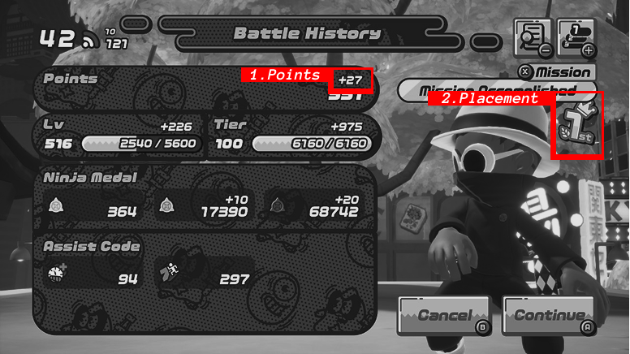
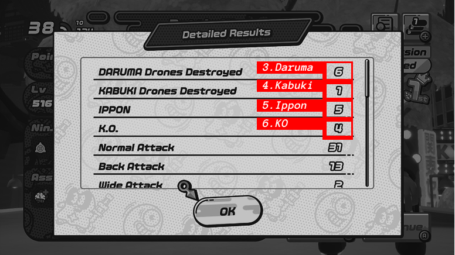

# About
This is an unofficial project related to the *Nintendo Switch* game **Ninjala™**.

This website is a tool to extract statistical values of given screenshots, and export them as an Excel file.
The idea is to evaluate and visualize the results of in-game tournaments held in Ninjala.

## About Ninjala™
Ninjala™ is a free-to-play multiplayer action game developed and published by GungHo Online Entertainment for the *Nintendo Switch*.
Create your own Ninja with various customization options and jump into an online battle with up to 8 player. Choose between a battle royale style and a team battle mode.
Official Website: https://ninjalathegame.com/en/

# How Does It Work
First, the tool filters and sorts the given screenshots. This happens based on the filename. When capturing screenshots with the Nintendo Switch System, the name always starts with a timestamp. This is very important to keep the correct order among other things. Doubles and screenshots of different games will be taken out based on the timestamp too, or the game identification code, which also is contained in the filename, provided the screenshots are transfered through the Micro SD card.

After filtering and sorting, the images will be paired, so that the right Battle History image and Detailed Result image are together. For this, the images will be categorized with, again, the timestamp and a sample extraction.

As everything is prepared, the extraction can begin. This step sadly does not use the common method called OCR (optical character recognition) but a more tailored approach. This was neccessary because the in-game font caused a lot of problems.
The extraction checks 6 fixed spots on the image pairs depicted below. It compares the regions with cutout templates and checks their simmilarity. Based on the result the tool finds out the correct values. These values are stored in a specific structure which then are written into a Excel File. Excel tables and functions are used, which makes it very easy to modify it afterwards, in case the tool recognized something wrong or if there were some missing images.

| Battle History | Detailed Result |
| -------------- | --------------- |
|  |  |

## How do my screenshots have to look like?
Capturing a screenshot with the Nintendo Switch or Nintendo Switch 2 have the following properties:
* file extension: .jpg
* MIME type: image/.jpeg
* resolution: 1280 x 720px

Please refrain from taking a screenshot of a recorded video, be it the Nintendo Switch System itself or a capture card, as this most likely will fail.

The website has been tested with the game set to english language but will most likely succeed with other languages including japanese, spanish, french italian and german. Korean and chinese are not supported, as the in-game font varies.

## Why is the Nintendo Switch App not supported?
Filtering, sorting and pairing happens based on the timestamp which is contained in the file name. Screenshots uploaded and downloaded from the Nitendo Switch App do have a timestamp in their name, however the upload date is taken instead of the creation date. This can lead to a wrong sorting order and thus messes up the statistic.   

## Why Excel File?
When I started to collect and created the tournament statistics I used Excel for this. The tool adds the values to the file in a way it's editable afterwards. So missing values can be added later on. These even will be considered in the charts and they will dynamically change.
